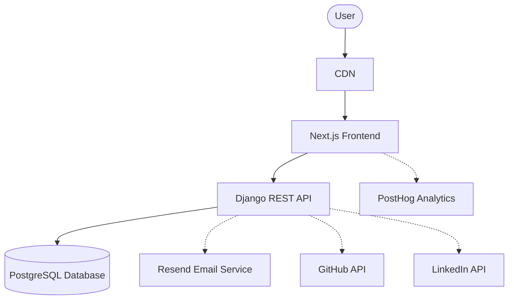
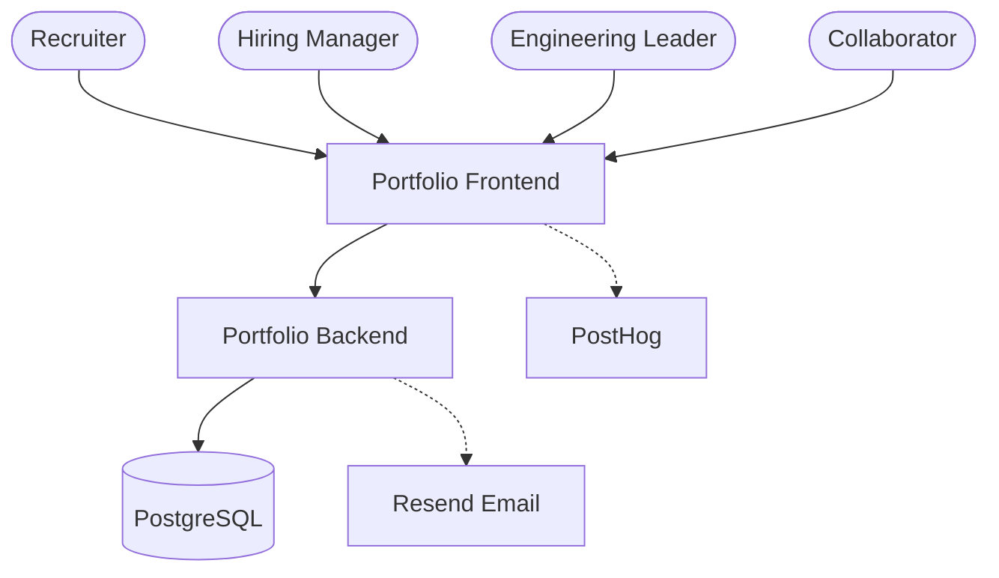
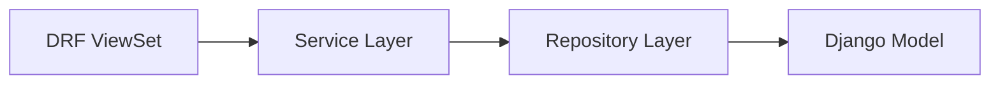
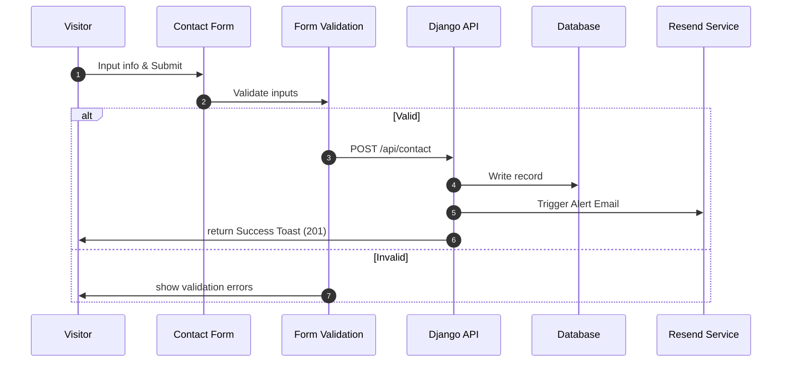
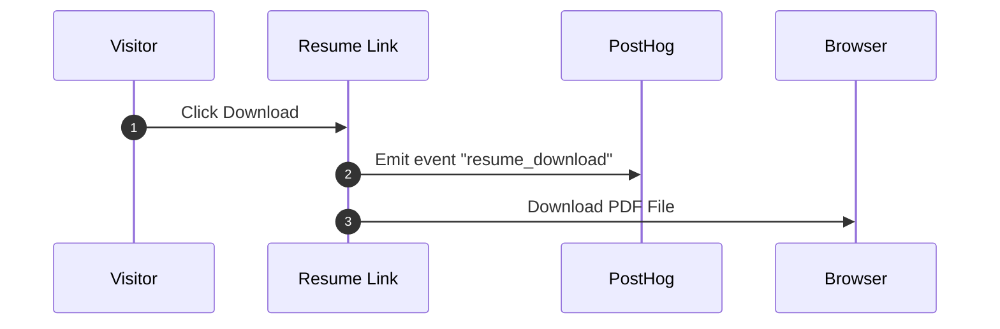
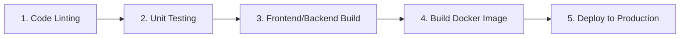

# Technical Requirements Document (TRD)
## Ganga Portfolio Platform v2.0

---

### 1. Document Information

| Field | Value |
| :--- | :--- |
| **Project** | Ganga Portfolio |
| **Version** | 2.0 |
| **Frontend** | Next.js 15 |
| **Backend** | Django + DRF |
| **Database** | PostgreSQL |
| **Deployment** | Vercel (Frontend) + Render (Backend) |
| **Infrastructure** | Docker + Nginx |
| **Analytics** | PostHog |
| **Email Service**| Resend |

---

### 2. Purpose
This document defines the complete technical architecture, implementation standards, infrastructure requirements, deployment strategy, security model, and development guidelines for the Portfolio Platform.

The platform must represent a modern AI Engineer portfolio showcasing:
* AI Engineering Experience
* Multi-Agent Systems
* Knowledge Graphs
* Backend Engineering
* Competitive Programming
* Architecture Thinking

---

### 3. System Overview
The application consists of:
1. Next.js Frontend
2. Django REST API
3. PostgreSQL Database
4. Analytics Platform
5. Email Service
6. CI/CD Pipeline

**Architecture Style:**
* Service-Oriented & API Driven
* Modular Monolith
* Clean Architecture

---

### 4. High Level Architecture



---

### 5. C4 Context Diagram



---

### 6. Frontend Architecture

#### Technology Stack
* Next.js 15 (App Router)
* TypeScript
* Tailwind CSS
* shadcn/ui component library
* Framer Motion (Snappy animations)
* Lucide Icons

#### Architecture Principles
* Server Components by default to optimize loading performance.
* Client Components only when user interactivity is required.
* Dry (Don't Repeat Yourself) components architecture.
* Feature-based layout organization.
* High accessibility (WCAG AA).

#### Folder Structure
```text
frontend/
├── app/          # App router pages and layouts
├── components/   # Reusable UI elements (buttons, inputs)
├── features/     # Feature-specific structures (projects, timeline)
├── hooks/        # Shared custom React hooks
├── services/     # API request hooks and service handlers
├── types/        # TypeScript interfaces and type files
├── lib/          # Utilities (cn, helpers)
├── public/       # Static assets (images, PDFs)
└── styles/       # Tailwind & CSS variables
```

---

### 7. Backend Architecture

#### Technology Stack
* Django
* Django REST Framework (DRF)
* PostgreSQL
* Gunicorn (WSGI server)

#### Architectural Pattern
The backend enforces clean separation of concerns:

> [!IMPORTANT]
> Business logic is strictly prohibited inside views. Views must only manage parsing, validation triggers, and HTTP responses.

#### Django Apps
* `core/` &mdash; Shared utilities, base models.
* `projects/` &mdash; Project definitions, metrics, and tags.
* `experience/` &mdash; Work timeline items and technologies.
* `skills/` &mdash; Core competencies categorized.
* `achievements/` &mdash; Codeforces ranks, certifications.
* `contact/` &mdash; Form messages submissions.
* `analytics/` &mdash; Action events tracking.

---

### 8. Database Architecture

#### Design Principles
* UUID v4 Primary Keys to prevent enumeration attacks and support easy data migrations.
* Soft Delete flags (`is_deleted`) to preserve metrics database history.
* Base audit timestamps on all relational tables.
* B-Tree indexes on frequently scanned lookup fields.

#### Table Outlines

##### Table: `projects`
* `id` (UUID PK)
* `title` (VARCHAR)
* `slug` (VARCHAR UNIQUE INDEX)
* `description` (TEXT)
* `github_url` (TEXT)
* `live_url` (TEXT)
* `featured` (BOOLEAN INDEX)
* `display_order` (INTEGER INDEX)
* `created_at`, `updated_at` (TIMESTAMP)

##### Table: `skills`
* `id` (UUID PK)
* `name` (VARCHAR)
* `category` (VARCHAR INDEX)
* `icon` (VARCHAR)

##### Table: `experience`
* `id` (UUID PK)
* `company` (VARCHAR)
* `role` (VARCHAR)
* `description` (TEXT)
* `start_date`, `end_date` (DATE)

##### Table: `contact_messages`
* `id` (UUID PK)
* `name` (VARCHAR)
* `email` (VARCHAR INDEX)
* `message` (TEXT)
* `created_at` (TIMESTAMP)

##### Table: `analytics_events`
* `id` (UUID PK)
* `event_name` (VARCHAR INDEX)
* `metadata` (JSONB)
* `created_at` (TIMESTAMP)

---

### 9. API Architecture

#### Public Endpoints

| Method | Endpoint | Description |
| :--- | :--- | :--- |
| `GET` | `/api/projects` | Fetch all featured or listed projects |
| `GET` | `/api/skills` | List categorized skills and experience tags |
| `GET` | `/api/experience` | Fetch the work timeline list |
| `GET` | `/api/achievements` | Fetch coding achievements and certs |
| `POST` | `/api/contact` | Submit a recruiter inquiry message |

#### Standards
* RESTful paths naming conventions.
* Standardized envelope JSON response payloads.
* Consistent HTTP error mappings.
* Robust schema validation on serializers.

---

### 10. Authentication Strategy
* **Version 2:** Standard content APIs remain public (Read access).
* **Administration:** Backend updates and content management handled via secure Django Admin console.
* **Future Extension:** JWT authentication, integration with OAuth providers, and Role-Based Access Controls (RBAC) for CMS dashboards.

---

### 11. Security Architecture

#### OWASP Controls
* **XSS Protection:** Escape HTML tags in templates, sanitize input data.
* **CSRF Protection:** Configured headers on state-changing REST routes.
* **Rate Limiting:** IP-based throttles on API submissions.
* **Secure Headers:** Implementation of CSP, HSTS, and Frame-Options.
* **Input Sanitization:** Parse forms through Django serializers to prevent injection.

#### Secrets Management
* Stored purely in environment variables (`.env`).
* No plain secrets or API tokens allowed in source control.

---

### 12. Logging Strategy
* **Frontend:** Browser-level JavaScript error boundaries capture unexpected crashes.
* **Backend:** Structured JSON formatting. Logs capture full request routes, durations, exceptions, and third-party API response states.

---

### 13. Monitoring Strategy
* **Metrics:** Capture API latency (target < 300ms), Largest Contentful Paint (LCP < 2.5s), and page-view volumes.
* **Monitoring Stack:** PostHog interaction funnels, Render runtime dashboards, and automated Django error email alerts.

---

### 14. Analytics Design
Supported tracking events logged to the dashboard:
* `page_view`
* `resume_download`
* `project_click`
* `contact_submission`
* `github_redirect`
* `linkedin_redirect`

---

### 15. Contact Flow



---

### 16. Resume Download Flow



---

### 17. CI/CD Architecture
Automated via GitHub Actions:



---

### 18. Docker Architecture
* **Containers:**
  * `frontend` &mdash; Next.js app container.
  * `backend` &mdash; Django API container.
  * `postgres` &mdash; Database container (local development).
  * `nginx` &mdash; Reverse proxy container.
* **Network:** Dedicated internal bridge network `portfolio-network`.

---

### 19. Deployment Architecture
* **Frontend:** Next.js deployed on Vercel Edge Networks.
* **Backend:** Django server deployed on Render Web Services.
* **Database:** Managed PostgreSQL instance with automated backups.
* **Network/Domain:** Custom domain mapped, SSL certificates generated dynamically.

---

### 20. Performance Requirements

| Metric | Target | Verification Method |
| :--- | :--- | :--- |
| **Homepage Load** | `< 2.0 seconds` | Chrome DevTools Performance |
| **API Response** | `< 300 milliseconds`| Django REST framework logs |
| **Largest Contentful Paint**| `< 2.5 seconds` | Lighthouse Diagnostics |
| **Availability** | `99.9% Uptime` | UptimeRobot Monitoring |

---

### 21. Accessibility Requirements
* Keyboard-only focus indicators for navigations.
* ARIA descriptors attached on icon buttons.
* Semantic HTML5 tag usage.
* WCAG AA contrast ratio compliance.

---

### 22. Coding Standards
* **Frontend:** TypeScript strict compiler flags, ESLint configurations, and Prettier auto-formatting.
* **Backend:** Python Black style guides, Ruff linters, strict typing hints, and detailed docstrings.

---

### 23. Testing Strategy
* **Frontend:** Component mounting tests, integrations tests.
* **Backend:** Unit test suites for services, viewset endpoints routing tests.
* **Test Coverage:** Enforce minimum 80% coverage targets on build pipelines.

---

### 24. Disaster Recovery
* Nightly automated database snapshots.
* Infrastructure defined declaratively (Docker Compose).
* Instant rollbacks enabled on the Vercel and Render deployment consoles.

---

### 25. Scalability Plan

| Stage | Scale Target | Strategy |
| :--- | :--- | :--- |
| **Phase 1** | < 1,000 users/day | Lightweight single instance containers |
| **Phase 2** | CDN Optimization | Edge caching static assets (Next.js Edge) |
| **Phase 3** | Caching Layer | Redis memory caching for slow queries |
| **Phase 4** | Container Orchestration | Auto-scaling groups on container runners |

---

### 26. Technical Risks

| Risk Description | Severity | Mitigation Strategy |
| :--- | :--- | :--- |
| **Over-engineering core components** | Medium | Maintain the MVP project structure, defer complexity until v2.0. |
| **Slow client loading animations** | High | Keep transitions under 400ms, optimize components bundles size. |
| **Content database overhead** | Low | Implement Postgres indexing strategies, cache static API records. |

---

### 27. Future Roadmap
* Modular Portfolio CMS admin panel.
* Embedded conversational AI Assistant.
* Zoomable system architecture visualizers.
* Dynamic administration analytics graphs.
* Knowledge Graph network visualization.
* Agentic sandbox coding playground.

---

### 28. Launch Checklist
- [ ] Frontend responsive layouts validated
- [ ] Backend API endpoints running stable
- [ ] Postgres migrations successfully applied
- [ ] Analytics triggers capturing client actions
- [ ] PDF download and contact email validated
- [ ] Lighthouse score target (> 90) achieved
- [ ] HTTPS and production domains connected

---

### Version History
* **Version 2.0**: Technical Requirements Document updates
