# Application Flow Document
## Ganga Portfolio Platform

---

### 1. Purpose
This document defines the user journeys, navigation structure, page interactions, business flows, event tracking, and recruiter experience throughout the portfolio application.

The goal is to create a seamless experience that helps visitors quickly understand:
* Who Ganga is
* What problems he solves
* His engineering expertise
* Project impact
* How to contact him

---

### 2. Primary User Types

* **Recruiter**
  * **Goals:** Understand profile quickly, download resume, contact candidate.
* **Hiring Manager**
  * **Goals:** Evaluate technical depth, review projects, assess architecture skills.
* **Engineering Leader**
  * **Goals:** Assess engineering maturity, understand business impact, evaluate system design thinking.
* **Collaborator**
  * **Goals:** Review projects, explore GitHub, contact for opportunities.

---

### 3. Global Navigation Flow
The global navigation allows seamless transitions between the landing page and all key sections.

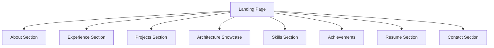

---

### 4. Homepage Flow
Expected Outcome: Visitor understands profile within 60 seconds.

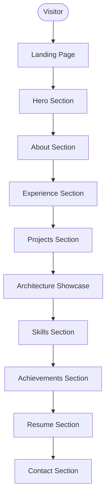

---

### 5. Hero Section Flow
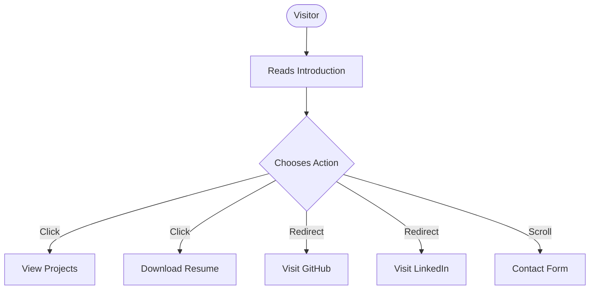

**Tracked Events:**
* `hero_cta_click`
* `resume_download`
* `github_redirect`
* `linkedin_redirect`

---

### 6. About Section Flow
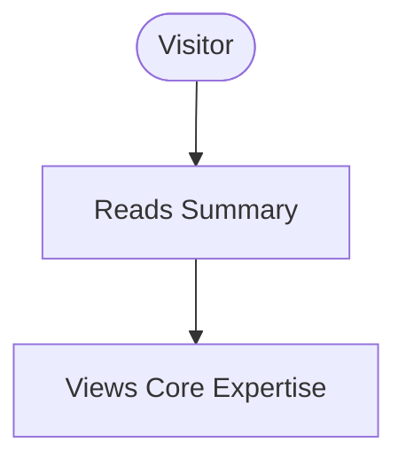

**Core Expertise Areas:**
* AI Engineering
* Multi-Agent Systems
* Backend Development
* Knowledge Graphs
* Competitive Programming

*Outcome: Visitor understands the candidate's specialization.*

---

### 7. Experience Flow
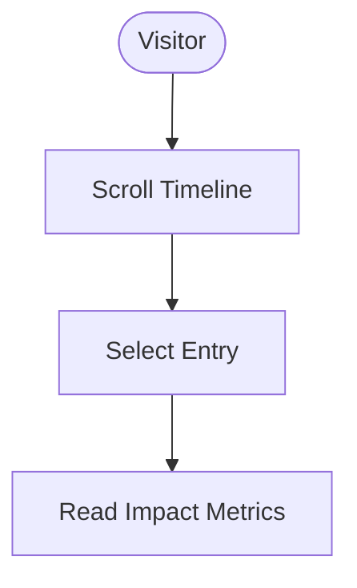

**Entries:**
* HP Intern &rarr; HP Software Engineer
* *Outcome: Visitor understands career progression.*

---

### 8. Projects Flow
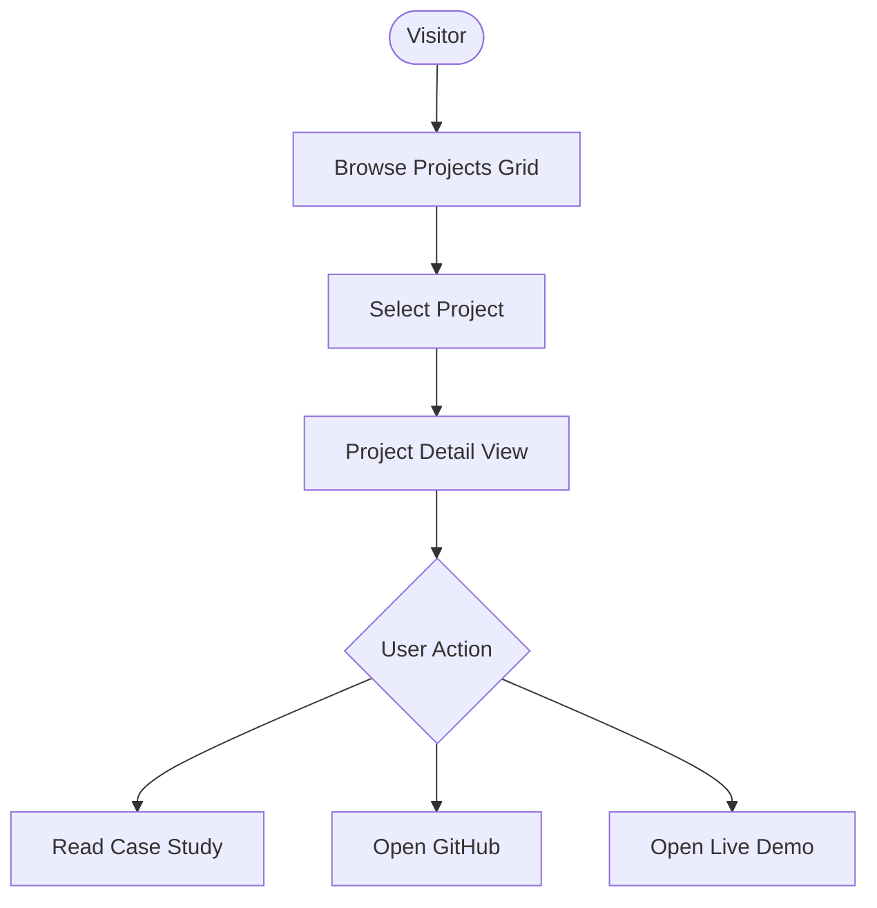

**Tracked Events:**
* `project_click`
* `github_project_click`
* `demo_click`

---

### 9. Project Detail Flow
Sections:
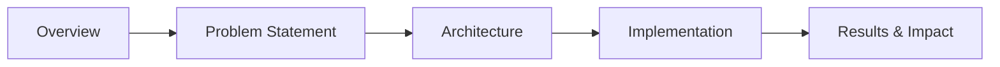
*Outcome: Visitor understands specific engineering capabilities and problem-solving depth.*

---

### 10. Architecture Showcase Flow
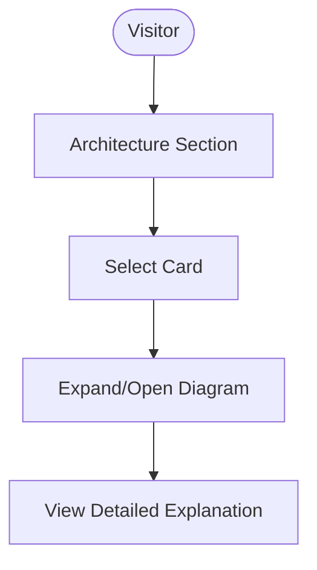

**Showcase Options:**
* Multi-Agent Architecture
* Knowledge Graph Pipeline
* Evaluation Framework
* Backend System Design

*Outcome: Demonstrates system architecture thinking.*

---

### 11. Skills Flow
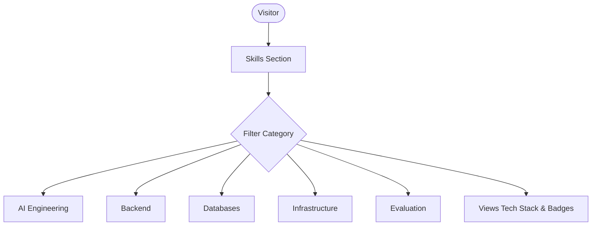
*Outcome: Quick skill assessment.*

---

### 12. Achievement Flow
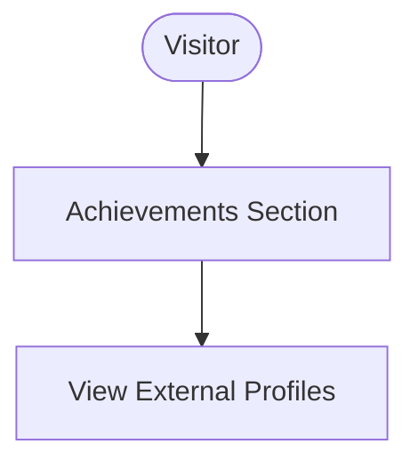

**Displayed Achievements:**
* Codeforces / CodeChef Ratings
* DSA Statistics
* Certifications

**Tracked Event:** `achievement_click`

---

### 13. Resume Flow
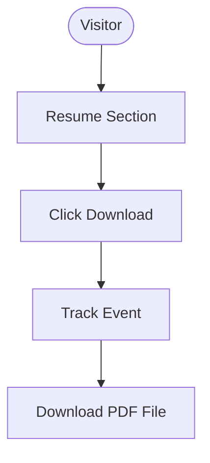

**Tracked Event:** `resume_download`  
*Outcome: Recruiter successfully obtains resume.*

---

### 14. Contact Flow
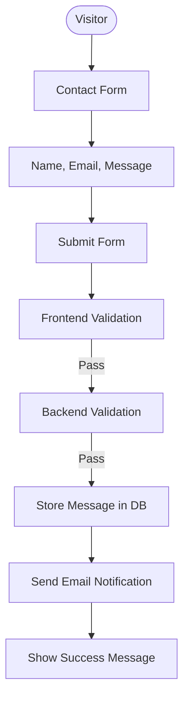

**Tracked Event:** `contact_submission`

---

### 15. Contact Error Flow
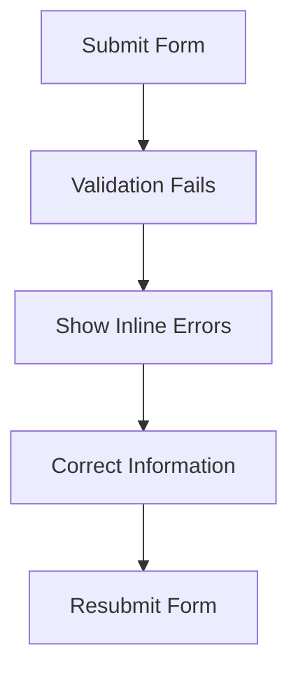

---

### 16. GitHub Redirect Flow
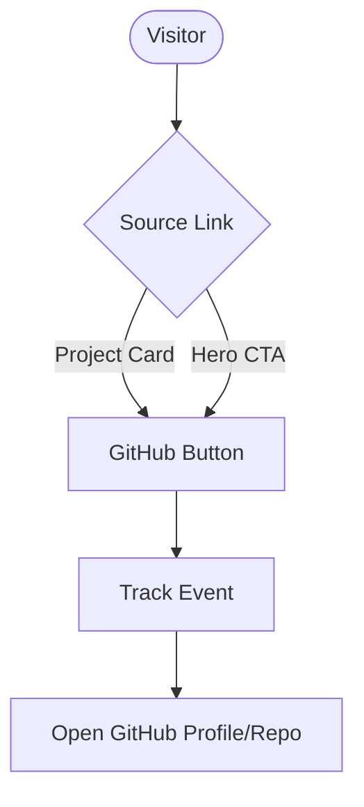

---

### 17. LinkedIn Redirect Flow
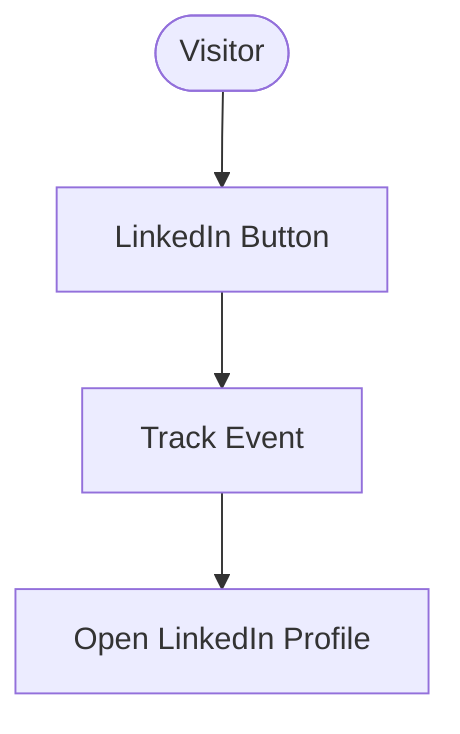

---

### 18. Mobile User Flow
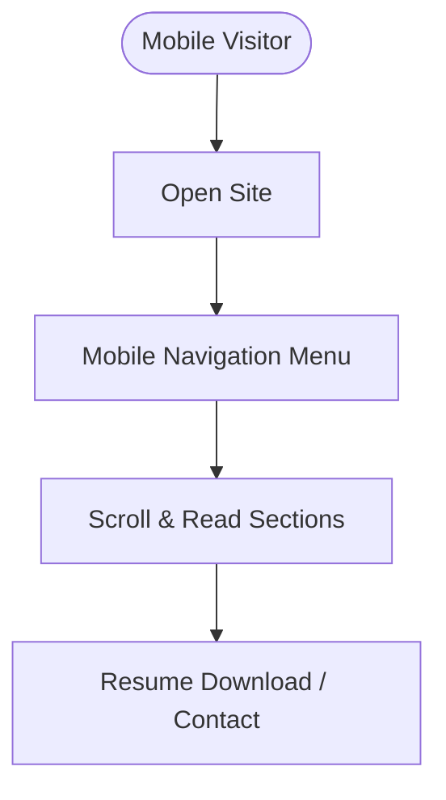
*Requirement: All layouts and flows must support mobile devices seamlessly.*

---

### 19. Analytics Flow
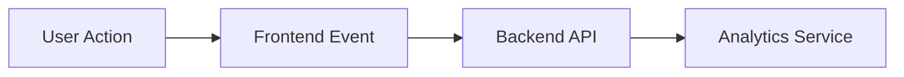

**Supported Tracking Events:**
* `page_view`
* `resume_download`
* `project_click`
* `github_redirect`
* `linkedin_redirect`
* `contact_submission`

---

### 20. Page Flow Diagram
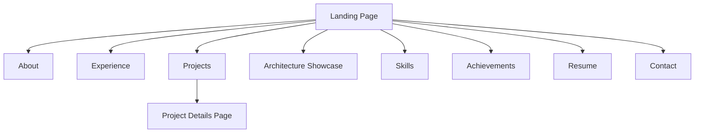

---

### 21. Recruiter Happy Path
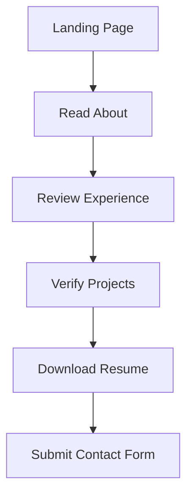
*Success Outcome: Recruiter schedules an interview.*

---

### 22. Hiring Manager Happy Path
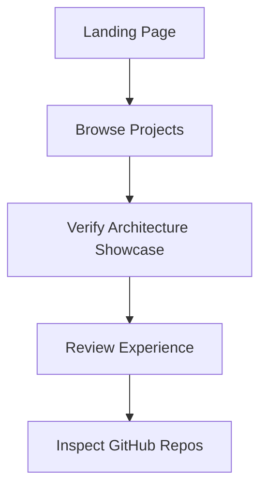
*Success Outcome: Technical evaluation completed.*

---

### 23. Conversion Funnel
```mermaid
graph TD
    Landing[Landing Page Visits]
    Landing --> Exp[Experience & Project Views]
    Exp --> Action{Conversions}
    Action --> |Primary| Contact[Contact Submission]
    Action --> |Secondary| Resume[Resume Download]
```

---

### 24. Future Flows

#### Portfolio AI Assistant
```mermaid
flowchart LR
    Visitor([Visitor]) --> Ask[Ask Question] --> Bot[AI Assistant] --> KB[Query Resume KB]
```

#### Interactive Architecture Explorer
```mermaid
flowchart LR
    Visitor([Visitor]) --> Open[Open Diagram] --> Zoom[Zoom & Interact] --> Expand[Expand Components]
```

#### CMS Content Management
```mermaid
flowchart LR
    Admin[Admin] --> Update[Update Content] --> Publish[Publish Changes]
```

---

### 25. Flow Validation Checklist
- [ ] Navigation Accessible
- [ ] Resume Download Works
- [ ] GitHub Links Work
- [ ] LinkedIn Links Work
- [ ] Contact Form Works
- [ ] Mobile Navigation Works
- [ ] Analytics Tracking Works
- [ ] Project Pages Accessible
- [ ] Architecture Showcase Accessible
- [ ] All CTAs Tracked

---

### Version History
* **Version 1.0**: Initial Application Flow Design
