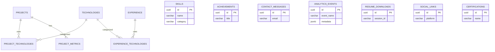

# Database Schema Document
## Ganga Portfolio Platform

---

### 1. Purpose
This document defines the database architecture, entity relationships, naming conventions, constraints, indexing strategy, and future scalability plans for the Portfolio Platform.

| Property | Value |
| :--- | :--- |
| **Database Engine** | PostgreSQL |
| **ORM** | Django ORM |
| **Architecture** | CMS Ready |

---

### 2. Design Principles
* **UUID Primary Keys:** All tables use UUID v4 primary keys for distributed-safe IDs.
* **Soft Delete Support:** Flag-based deletion (`is_deleted`) to preserve audit history.
* **Audit Fields on All Tables:** Automatic timestamps for creation and modifications.
* **Future CMS Compatibility:** Schema decoupled from UI to allow easy management.
* **Optimized Read Performance:** Thorough indexing on frequently queried columns.
* **Consistent Naming Conventions:** Snake-case for all table names and columns.

---

### 3. Naming Conventions
* **Tables:** `snake_case` (plural, e.g., `projects`)
* **Columns:** `snake_case` (e.g., `short_description`)
* **Primary Keys:** `id` (UUID)
* **Foreign Keys:** `<singular_entity_name>_id` (e.g., `project_id`)
* **Timestamps:** `created_at`, `updated_at`

---

### 4. Common Audit Fields
All main application tables must contain the following fields:

| Field | Type | Constraints | Description |
| :--- | :--- | :--- | :--- |
| `id` | `UUID` | Primary Key, Default: UUID v4 | Unique identifier |
| `created_at` | `TIMESTAMP` | Auto-populate on creation | Timestamp of record creation |
| `updated_at` | `TIMESTAMP` | Auto-update on modification | Timestamp of last modification |
| `is_active` | `BOOLEAN` | Default: `true` | Toggle visibility of the record |
| `is_deleted` | `BOOLEAN` | Default: `false` | soft-delete status flag |

---

### 5. Entity Relationship Diagram

---

### 6. Projects Table
* **Table Name:** `projects`

| Column | Data Type | Key / Constraint | Index | Description |
| :--- | :--- | :--- | :--- | :--- |
| `id` | `UUID` | PK | Yes | Unique project ID |
| `title` | `VARCHAR(255)` | Not Null | No | Title of project |
| `slug` | `VARCHAR(255)` | Unique, Not Null | Yes | URL-friendly unique slug |
| `short_description`| `TEXT` | Not Null | No | Brief summary card text |
| `full_description` | `TEXT` | Not Null | No | Full Markdown case study |
| `github_url` | `TEXT` | Nullable | No | Link to source repository |
| `live_url` | `TEXT` | Nullable | No | Link to running production app |
| `thumbnail_url` | `TEXT` | Nullable | No | Path to display image |
| `featured` | `BOOLEAN` | Default: `false` | Yes | Shows on homepage if true |
| `display_order` | `INTEGER` | Default: `0` | Yes | Sort order on display grids |
| `status` | `VARCHAR(50)` | Default: `'active'`| No | Status (e.g., draft, active) |
| `created_at` | `TIMESTAMP` | Audit | No | Record creation time |
| `updated_at` | `TIMESTAMP` | Audit | No | Record update time |
| `is_active` | `BOOLEAN` | Audit | No | Visibility flag |
| `is_deleted` | `BOOLEAN` | Audit | No | Soft-delete flag |

---

### 7. Project Technologies Table
* **Table Name:** `project_technologies`
* **Purpose:** Many-to-Many join table mapping projects to core technologies.

| Column | Data Type | Key / Constraint | Index | Description |
| :--- | :--- | :--- | :--- | :--- |
| `id` | `UUID` | PK | Yes | Unique relationship ID |
| `project_id` | `UUID` | FK (`projects.id`) | Yes | Reference to project |
| `technology_id` | `UUID` | FK (`technologies.id`)| Yes | Reference to technology |
| `created_at` | `TIMESTAMP` | Default: Now | No | Time tag was attached |

---

### 8. Project Metrics Table
* **Table Name:** `project_metrics`
* **Purpose:** Stores specific impact and performance metrics for portfolio showcase.

| Column | Data Type | Key / Constraint | Index | Description |
| :--- | :--- | :--- | :--- | :--- |
| `id` | `UUID` | PK | Yes | Unique metric ID |
| `project_id` | `UUID` | FK (`projects.id`) | Yes | Reference to project |
| `metric_name` | `VARCHAR(255)` | Not Null | No | Label (e.g., "Accuracy Gain") |
| `metric_value` | `VARCHAR(255)` | Not Null | No | Value (e.g., "60%") |
| `created_at` | `TIMESTAMP` | Default: Now | No | Time recorded |

---

### 9. Experience Table
* **Table Name:** `experience`

| Column | Data Type | Key / Constraint | Index | Description |
| :--- | :--- | :--- | :--- | :--- |
| `id` | `UUID` | PK | Yes | Unique experience ID |
| `company_name` | `VARCHAR(255)` | Not Null | Yes | Company name |
| `role` | `VARCHAR(255)` | Not Null | No | Job title |
| `employment_type` | `VARCHAR(100)` | Not Null | No | Full-time, Internship, etc. |
| `location` | `VARCHAR(255)` | Nullable | No | City/country or Remote |
| `start_date` | `DATE` | Not Null | No | Starting date |
| `end_date` | `DATE` | Nullable | No | Departure date |
| `currently_working`| `BOOLEAN` | Default: `false` | No | Flag if current employer |
| `description` | `TEXT` | Not Null | No | Role description / bullet points |
| `display_order` | `INTEGER` | Default: `0` | Yes | Sort order on timeline |
| `created_at` | `TIMESTAMP` | Audit | No | Record creation time |
| `updated_at` | `TIMESTAMP` | Audit | No | Record update time |

---

### 10. Experience Technologies Table
* **Table Name:** `experience_technologies`
* **Purpose:** Many-to-Many mapping for technologies utilized in specific roles.

| Column | Data Type | Key / Constraint | Index | Description |
| :--- | :--- | :--- | :--- | :--- |
| `id` | `UUID` | PK | Yes | Unique relationship ID |
| `experience_id` | `UUID` | FK (`experience.id`)| Yes | Reference to work entry |
| `technology_id` | `UUID` | FK (`technologies.id`)| Yes | Reference to technology |
| `created_at` | `TIMESTAMP` | Default: Now | No | Date mapped |

---

### 11. Skills Table
* **Table Name:** `skills`

| Column | Data Type | Key / Constraint | Index | Description |
| :--- | :--- | :--- | :--- | :--- |
| `id` | `UUID` | PK | Yes | Unique skill ID |
| `name` | `VARCHAR(255)` | Not Null | No | Skill name (e.g., Python) |
| `category` | `VARCHAR(255)` | Not Null | Yes | Categorization group |
| `icon_name` | `VARCHAR(255)` | Nullable | No | Lucide icon identifier |
| `years_of_experience`| `INTEGER` | Default: `0` | No | Duration of usage |
| `display_order` | `INTEGER` | Default: `0` | Yes | Sort order |
| `created_at` | `TIMESTAMP` | Audit | No | Creation timestamp |
| `updated_at` | `TIMESTAMP` | Audit | No | Modification timestamp |

---

### 12. Achievements Table
* **Table Name:** `achievements`

| Column | Data Type | Key / Constraint | Index | Description |
| :--- | :--- | :--- | :--- | :--- |
| `id` | `UUID` | PK | Yes | Unique achievement ID |
| `title` | `VARCHAR(255)` | Not Null | No | Achievement headline |
| `description` | `TEXT` | Nullable | No | Detailed outline |
| `achievement_type` | `VARCHAR(255)` | Not Null | Yes | Category (e.g., Competitive Coding)|
| `external_url` | `TEXT` | Nullable | No | Verification link |
| `display_order` | `INTEGER` | Default: `0` | Yes | Sort order |
| `created_at` | `TIMESTAMP` | Audit | No | Record creation time |
| `updated_at` | `TIMESTAMP` | Audit | No | Record update time |

---

### 13. Technologies Table
* **Table Name:** `technologies`
* **Purpose:** Central catalog of technologies used in projects and experience.

| Column | Data Type | Key / Constraint | Index | Description |
| :--- | :--- | :--- | :--- | :--- |
| `id` | `UUID` | PK | Yes | Unique technology ID |
| `name` | `VARCHAR(255)` | Unique, Not Null | No | Technology name (e.g. Django) |
| `slug` | `VARCHAR(255)` | Unique, Not Null | Yes | URL-friendly identifier |
| `icon_name` | `VARCHAR(255)` | Nullable | No | Icon display key |
| `category` | `VARCHAR(255)` | Not Null | Yes | Grouping (e.g., Backend) |
| `created_at` | `TIMESTAMP` | Default: Now | No | Creation timestamp |
| `updated_at` | `TIMESTAMP` | Default: Now | No | Last modification timestamp |

---

### 14. Contact Messages Table
* **Table Name:** `contact_messages`

| Column | Data Type | Key / Constraint | Index | Description |
| :--- | :--- | :--- | :--- | :--- |
| `id` | `UUID` | PK | Yes | Unique message ID |
| `name` | `VARCHAR(255)` | Not Null | No | Senders name |
| `email` | `VARCHAR(255)` | Not Null | Yes | Senders email address |
| `message` | `TEXT` | Not Null | No | Message body content |
| `status` | `VARCHAR(50)` | Default: `'unread'`| Yes | Review status (e.g., unread, read) |
| `ip_hash` | `VARCHAR(255)` | Not Null | No | Hashed IP to prevent spamming |
| `created_at` | `TIMESTAMP` | Default: Now | Yes | Time sent |

---

### 15. Resume Downloads Table
* **Table Name:** `resume_downloads`
* **Purpose:** Tracks unique download transactions of the resume.

| Column | Data Type | Key / Constraint | Index | Description |
| :--- | :--- | :--- | :--- | :--- |
| `id` | `UUID` | PK | Yes | Unique download transaction ID |
| `session_id` | `VARCHAR(255)` | Nullable | No | Frontend session context |
| `ip_hash` | `VARCHAR(255)` | Not Null | No | Hashed IP address of visitor |
| `country` | `VARCHAR(255)` | Nullable | Yes | Resolved location country |
| `city` | `VARCHAR(255)` | Nullable | No | Resolved location city |
| `downloaded_at` | `TIMESTAMP` | Default: Now | Yes | Timestamp of download |

---

### 16. Analytics Events Table
* **Table Name:** `analytics_events`

| Column | Data Type | Key / Constraint | Index | Description |
| :--- | :--- | :--- | :--- | :--- |
| `id` | `UUID` | PK | Yes | Unique event ID |
| `event_name` | `VARCHAR(255)` | Not Null | Yes | Event name (e.g., page_view) |
| `page` | `VARCHAR(255)` | Not Null | Yes | Path of event action |
| `session_id` | `VARCHAR(255)` | Nullable | No | Browser session key |
| `metadata` | `JSONB` | Default: `{}` | Yes (GIN)| Flexible JSON event context data |
| `created_at` | `TIMESTAMP` | Default: Now | Yes | Event creation timestamp |

---

### 17. Social Links Table
* **Table Name:** `social_links`

| Column | Data Type | Key / Constraint | Index | Description |
| :--- | :--- | :--- | :--- | :--- |
| `id` | `UUID` | PK | Yes | Unique link ID |
| `platform` | `VARCHAR(255)` | Not Null | Yes | Platform name (e.g. GitHub) |
| `url` | `TEXT` | Not Null | No | Profile hyperlink URL |
| `icon_name` | `VARCHAR(255)` | Nullable | No | Platform icon label |
| `display_order` | `INTEGER` | Default: `0` | No | Sort order |
| `created_at` | `TIMESTAMP` | Default: Now | No | Time record created |

---

### 18. Certifications Table
* **Table Name:** `certifications`

| Column | Data Type | Key / Constraint | Index | Description |
| :--- | :--- | :--- | :--- | :--- |
| `id` | `UUID` | PK | Yes | Unique certification ID |
| `name` | `VARCHAR(255)` | Not Null | No | Name of certification |
| `issuer` | `VARCHAR(255)` | Not Null | Yes | Issuing authority |
| `issue_date` | `DATE` | Not Null | No | Date of issuance |
| `certificate_url`| `TEXT` | Nullable | No | Verification link |
| `display_order` | `INTEGER` | Default: `0` | No | Sort order |
| `created_at` | `TIMESTAMP` | Default: Now | No | Record creation time |

---

### 19. Site Configuration Table
* **Table Name:** `site_configurations`
* **Purpose:** CMS-style settings to manage landing page config values dynamically.

| Column | Data Type | Key / Constraint | Index | Description |
| :--- | :--- | :--- | :--- | :--- |
| `id` | `UUID` | PK | Yes | Unique config ID |
| `config_key` | `VARCHAR(255)` | Unique, Not Null | Yes | Key (e.g. "WELCOME_TEXT") |
| `config_value` | `TEXT` | Not Null | No | Content value |
| `created_at` | `TIMESTAMP` | Default: Now | No | Creation timestamp |
| `updated_at` | `TIMESTAMP` | Default: Now | No | Modification timestamp |

---

### 20. Future Blog Tables
*Reserved for Future Version releases.*
* **Table Name:** `blogs`
  * `id` (UUID PK)
  * `title` (VARCHAR)
  * `slug` (VARCHAR UNIQUE)
  * `content` (TEXT)
  * `published_at` (TIMESTAMP)

---

### 21. Future AI Assistant Tables
* **Table Name:** `knowledge_documents`
  * `id` (UUID PK)
  * `title` (VARCHAR)
  * `content` (TEXT)
  * `source` (VARCHAR)
  * `embedding_reference` (VECTOR/JSONB)
  * `created_at` (TIMESTAMP)

---

### 22. JSONB Usage
**Approved Tables:** `analytics_events`, `knowledge_documents`  
**Reasons:**
* **Flexible Schema:** Event contexts contain variable structures depending on event names.
* **Fast Querying:** PostgreSQL supports high-performance querying on JSON keys.
* **AI Readiness:** Facilitates storing unstructured knowledge metadata.

---

### 23. Indexing Strategy
The following indexes are designated high priority for search optimization:
* `projects.slug`
* `skills.category`
* `analytics_events.event_name`
* `contact_messages.email`
* `resume_downloads.downloaded_at`

---

### 24. Soft Delete Strategy
The columns `is_active` (boolean) and `is_deleted` (boolean) are implemented across core entities. Record deletion calls update `is_deleted = true` instead of calling `DELETE` operations. This maintains operational data history for compliance and auditing.

---

### 25. Data Retention Policies

| Entity Data Type | Retention Period | Action |
| :--- | :--- | :--- |
| **Contact Messages** | 3 Years | Soft delete & archive |
| **Analytics Log Events** | 2 Years | Prune older events |
| **Resume Downloads Log** | 2 Years | Prune older downloads |
| **Server Operations Logs** | 90 Days | Hard delete |

---

### 26. Security Considerations
* **Store IP Hash:** Hash visitor IP addresses with a secure salt before writing to `resume_downloads` or `contact_messages` to comply with user privacy regulations.
* **Never Store:** Plain text IP addresses, user credentials, secrets, or financial data.

---

### 27. Migration Strategy
* All schema changes must be driven through standard Django migrations.
* Direct manual SQL schema definitions on database servers are prohibited.
* Production changes require running test migrations against a replica database.

---

### 28. Backup Strategy
* **Daily Backups:** Automated daily snapshot backups.
* **Retention:** Maintain daily backups for 7 days.
* **Monthly:** Retain one monthly snapshot backup for archiving.

---

### 29. Scalability Considerations
The PostgreSQL architecture is built to support:
* CMS-driven content management
* AI Chat Assistant embeddings
* Rich project interaction analytics
* Graph-relation visualization mappings

---

### 30. Schema Validation Checklist
- [ ] UUID Primary Keys applied on all tables
- [ ] Foreign keys strictly defined with appropriate delete cascading rules
- [ ] High-priority indexes created on lookup slug/category columns
- [ ] Soft-delete logic and columns implemented
- [ ] Standard audit fields (`created_at`, `updated_at`) set up on entities
- [ ] JSONB structure designed for analytics
- [ ] Schema decouples content from front-end presentation

---

### Version History
* **Version 1.0**: Initial Database Schema Design
